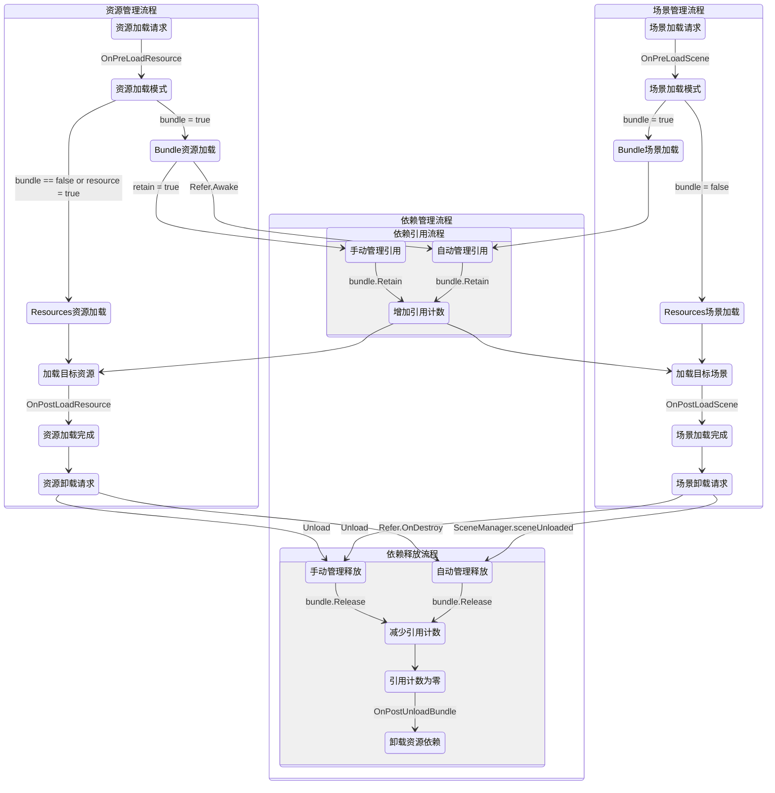

# XAsset.Core

[](https://www.npmjs.com/package/io.eframework.unity.asset)
[](https://openupm.com/packages/io.eframework.unity.asset)
[](https://deepwiki.com/eframework-io/Unity.Asset)
[](https://discord.gg/XMPx2wXSz3)

提供了内部事件管理器、异步加载处理器等功能，是资源管理器的基础模块。

## 功能特性

- 内部事件管理器：定义资源系统生命周期中的关键事件
- 异步加载处理器：负责跟踪和管理异步资源加载的过程

## 使用手册

### 1. 运行流程

以下流程图展示了资源管理器的运行时逻辑，包括资源/场景加载/卸载、引用计数管理、内置事件机制的主要流程：



### 2. 事件类型

- 功能说明：定义资源生命周期中的关键事件
- 事件列表：
  - `OnPreLoadResource`：资源加载前
  - `OnPostLoadResource`：资源加载后
  - `OnPreLoadScene`：场景加载前
  - `OnPostLoadScene`：场景加载后
  - `OnPostUnloadBundle`：资源包卸载后
- 使用示例：
```csharp
XAsset.Event.Register(XAsset.EventType.OnPreLoadResource, (asset) => Debug.Log("资源加载前：" + asset));
```

## 常见问题

更多问题，请查阅[问题反馈](../CONTRIBUTING.md#问题反馈)。

## 项目信息

- [更新记录](../CHANGELOG.md)
- [贡献指南](../CONTRIBUTING.md)
- [许可协议](../LICENSE.md)
